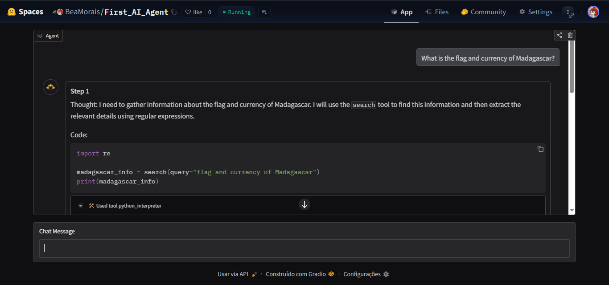

# First AI Agent 

---

## Descrição

Este projeto foi desenvolvido como parte do módulo introdutório do curso de AI Agents da [Hugging Face](https://huggingface.co/).  
Com base em um template da comunidade, este é o meu primeiro agente de IA, que pode ser testado aqui [Hugging Face Space](https://huggingface.co/spaces/BeaMorais/First_AI_Agent).   

O agente é capaz de realizar buscas na internet e utiliza ferramentas específicas para responder perguntas e executar pequenas tarefas úteis, como:  

🕓 Informar a **hora atual** em qualquer local do mundo  
🥣 **Converter medidas** (ex: ml → xícaras)  
🌎 **Traduzir textos** entre idiomas  
🏳️ Exibir a **bandeira e a moeda** de um país  

---

## Tecnologias Utilizadas

- **Python**
- **Hugging Face Agents SDK**
- **Gradio** (para a interface interativa)
- **APIs externas** para buscas e dados contextuais

## Preview

